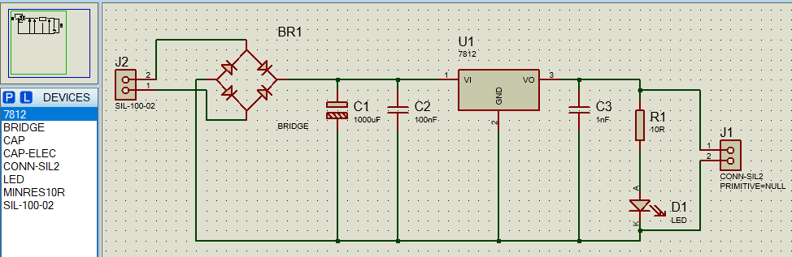
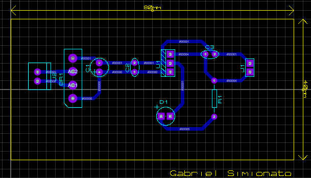

# 🔌 Carregador de Celular — Fonte Regulada 12V com 7812

> Projeto acadêmico desenvolvido para a disciplina de **Sistemas Embarcados**  
> Curso de Sistemas de Informação — Unimater, Pato Branco/PR  
> Autor: **Gabriel Zanesco Simionato**

---

## 📋 Sumário

- [Introdução](#introdução)
- [Objetivo](#objetivo)
- [Componentes Utilizados](#componentes-utilizados)
- [Esquemático do Circuito](#esquemático-do-circuito)
- [Jornada da Onda Elétrica](#jornada-da-onda-elétrica)
- [Funcionamento Detalhado de Cada Componente](#funcionamento-detalhado-de-cada-componente)
- [Layout da PCB](#layout-da-pcb)
- [Visualização 3D](#visualização-3d)
- [Software Utilizado](#software-utilizado)
- [Considerações Técnicas](#considerações-técnicas)

---

## Introdução

Este projeto consiste no desenvolvimento de um **carregador de celular baseado em fonte de alimentação linear regulada de 12V**, utilizando o regulador integrado **7812**. Todo o projeto foi desenvolvido no software **Proteus 8 Professional**, contemplando três etapas:

- Esquemático eletrônico (ISIS)
- Layout da placa de circuito impresso — PCB (ARES)
- Visualização 3D da placa montada

O circuito recebe tensão AC proveniente do secundário de um transformador externo, realiza a retificação, filtragem e regulação, entregando na saída **12V DC estável** com indicação visual de funcionamento via LED.

---

## Objetivo

Demonstrar na prática o funcionamento de uma **fonte linear regulada**, percorrendo todas as etapas do processo:

1. Entrada de tensão alternada (AC)
2. Retificação em onda completa
3. Filtragem e redução de ripple
4. Regulação da tensão de saída
5. Indicação de funcionamento por LED
6. Disponibilização da tensão regulada na saída

---

## Componentes Utilizados

| Referência | Componente | Valor | Função |
|---|---|---|---|
| J2 | SIL-100-02 | — | Conector de entrada — secundário do transformador (AC) |
| BR1 | BRIDGE | — | Ponte retificadora — converte AC em DC pulsante |
| C1 | CAP-ELEC | 1000µF | Capacitor de filtragem principal — reduz o ripple |
| C2 | CAP | 100nF | Capacitor de desacoplamento — filtra ruídos de alta frequência na entrada |
| U1 | 7812 | 12V | Regulador linear de tensão — estabiliza a saída em 12V |
| C3 | CAP | 1nF | Capacitor de estabilização da saída do regulador |
| R1 | MINRES10R | 10Ω | Resistor limitador de corrente do LED |
| D1 | LED | — | Indicador visual de funcionamento |
| J1 | CONN-SIL2 | — | Conector de saída — fornece 12V DC regulado |

---

## Esquemático do Circuito



---

## Jornada da Onda Elétrica

Esta seção mostra visualmente o que acontece com a forma de onda elétrica ao passar por cada componente do circuito, desde a entrada AC até a saída DC estabilizada.

---

### ⚡ Etapa 0 — Rede Elétrica (antes do transformador)

```
Tensão: 220V AC
        
  +220V  ╭───╮           ╭───╮
         │   │           │   │
─────────╯   ╰───────────╯   ╰─────
         
  -220V      ╭───╮           ╭───╮
             │   │           │   │
```

A rede elétrica fornece **220V AC** — uma onda senoidal que oscila entre positivo e negativo continuamente em 60Hz (60 vezes por segundo). Essa tensão é alta demais e alternada demais para alimentar circuitos eletrônicos diretamente.

---

### 🔌 Etapa 1 — Transformador → J2 (SIL-100-02)

```
Tensão: ~15V AC (secundário)

  +15V  ╭──╮        ╭──╮
        │  │        │  │
────────╯  ╰────────╯  ╰────────
        
  -15V     ╭──╮        ╭──╮
            │  │        │  │
```

O transformador (externo à placa) **reduz a amplitude da onda** de 220V para aproximadamente 15V AC, mantendo o formato senoidal. A onda continua alternando entre positivo e negativo — ainda é AC. O conector **J2** é onde essa tensão reduzida entra na placa.

> 📌 A onda ainda oscila entre +15V e -15V, mas agora em amplitude segura para o circuito.

---

### 🔄 Etapa 2 — Ponte Retificadora → BR1 (BRIDGE)f

```
Tensão: DC pulsante (~15V)

  +15V  ╭──╮  ╭──╮  ╭──╮  ╭──╮
        │  │  │  │  │  │  │  │
────────╯  ╰──╯  ╰──╯  ╰──╯  ╰──
  
   0V
```

A ponte retificadora **"dobra" a onda para cima** — ela pega os semiciclos negativos (que iam para baixo) e os inverte, fazendo com que a tensão nunca mais fique negativa. Isso é chamado de **retificação em onda completa**.

> 📌 A onda agora só tem valores positivos, mas ainda sobe e desce rapidamente — é um DC pulsante, não estável. A frequência das pulsações passa a ser 120Hz (o dobro da rede).

---

### 🏔️ Etapa 3 — Filtro Principal → C1 (1000µF)

```
Tensão: DC com leve ripple (~15V)

  +15V  ╭─────────────────────────
        │ ≈≈≈≈≈≈≈≈≈≈≈≈≈≈≈≈≈≈≈≈≈≈  ← pequenas ondulações (ripple)
        │
   0V
```

O capacitor eletrolítico de **1000µF funciona como um reservatório de energia**. Ele carrega durante os picos da onda pulsante e descarrega quando a tensão começa a cair, preenchendo os "vales". O resultado é uma tensão quase contínua, com pequenas oscilações chamadas de **ripple**.

> 📌 Quanto maior o capacitor, menor o ripple. O C1 de 1000µF é grande o suficiente para suavizar bem a tensão neste circuito.

---

### 🔇 Etapa 3.1 — Filtro de Ruído → C2 (100nF)

```
Sem C2:                         Com C2:
          ___/\/\/\___                    ──────────────
  ───────╱             ╲───      ──────────────────────
         ruídos HF visíveis      ruídos eliminados
```

O capacitor cerâmico de **100nF age como um filtro passa-baixa** para os ruídos de alta frequência (interferências eletromagnéticas, chaveamentos, etc.) que o C1 de grande valor não consegue eliminar por sua lentidão de resposta. Ele oferece um caminho de baixa impedância para que esses ruídos se dissipem para o GND antes de chegar ao regulador.

> 📌 O C1 cuida das oscilações lentas (baixa frequência). O C2 cuida dos ruídos rápidos (alta frequência). Juntos, entregam uma tensão limpa ao regulador.

---

### 📐 Etapa 4 — Regulador de Tensão → U1 (7812)

```
Entrada (VI):                   Saída (VO):
  +15V  ╭────────────────        +12V  ════════════════
        │ ≈≈≈≈≈≈≈≈≈≈≈≈≈≈≈                linha perfeitamente reta
        │
   0V                             0V
```

O regulador **7812 é o componente mais importante do circuito**. Ele recebe a tensão filtrada (com leve ripple em ~15V) e usa internamente um circuito de controle para manter a saída **travada em exatamente 12V**, independente de variações na entrada ou na corrente consumida pela carga.

A diferença de tensão entre entrada e saída (neste caso ~3V) é dissipada como **calor** pelo regulador — por isso ele esquenta durante o funcionamento.

> 📌 Antes do 7812: tensão variável com ripple. Depois do 7812: linha reta e estável em 12V. Esta é a etapa que transforma a fonte em "regulada".

---

### 🔇 Etapa 4.1 — Estabilização da Saída → C3 (1nF)

```
Sem C3:                         Com C3:
  +12V  ══════/\/\══════          +12V  ════════════════
        pequenas oscilações             saída limpa e estável
```

O capacitor cerâmico de **1nF na saída do regulador** elimina qualquer oscilação residual ou ruído de alta frequência que o próprio 7812 possa introduzir na saída. Ele melhora a estabilidade do regulador, especialmente em variações rápidas de carga.

> 📌 É um capacitor pequeno, mas essencial para garantir que a saída seja livre de ruídos de alta frequência.

---

### 💡 Etapa 5 — Indicador LED → D1 + R1

```
  +12V ──── R1 (10Ω) ──── D1 (LED) ──── GND
  
  Corrente: I = (12V - 2V) / 10Ω ≈ 1A  ← R1 protege o LED
```

Com a fonte funcionando, a tensão de 12V força corrente pelo resistor R1 e pelo LED D1. O resistor **limita a corrente** para que o LED não seja danificado por excesso. Enquanto houver tensão na saída, o LED permanece aceso, indicando visualmente que o circuito está energizado.

---

### 🔋 Etapa 6 — Saída Regulada → J1 (CONN-SIL2)

```
  +12V  ════════════════════════════════  → Pino 1 de J1
  
   GND  ────────────────────────────────  → Pino 2 de J1
```

A tensão final — **12V DC estável, contínua e livre de ruídos** — é disponibilizada no conector J1 para alimentar o dispositivo externo.

---

### 🗺️ Resumo Visual da Jornada Completa

```
 REDE         TRANSF.       RETIFIC.       FILTRO        REGULADOR      SAÍDA
 220V AC  →   15V AC   →   DC pulsante →  DC suavizado → 12V DC reto →  12V DC
 
 ╭──╮         ╭─╮          ╭╮╭╮╭╮╭╮       ╭────────      ══════════    ══════════
 │  │   →     │ │    →     ││││││││  →    │≈≈≈≈≈≈≈≈  →               →
─╯  ╰─      ──╯ ╰──        ╯╯╯╯╯╯╯╯      │           
 -220V         -15V           0V           0V            0V              0V
 
              J2           BR1           C1+C2          7812           J1
```

---

## Funcionamento Detalhado de Cada Componente

### J2 — Conector de Entrada (SIL-100-02)
Ponto de entrada do circuito. Recebe os dois terminais do secundário do transformador externo e conduz a tensão AC reduzida para a ponte retificadora.

### BR1 — Ponte Retificadora (BRIDGE)
Composta internamente por quatro diodos em configuração de ponte de Graetz. Converte a tensão AC em DC pulsante por meio da retificação em onda completa, invertendo os semiciclos negativos para positivos.

### C1 — Capacitor Eletrolítico (1000µF)
Filtro principal de baixa frequência. Armazena carga nos picos da tensão pulsante e a libera nos vales, reduzindo drasticamente o ripple e aproximando a tensão de uma linha contínua.

### C2 — Capacitor Cerâmico (100nF)
Filtro de alta frequência posicionado na entrada do regulador. Oferece baixa impedância para ruídos HF, desviando-os para o GND antes que perturbem o regulador.

### U1 — Regulador 7812
Mantém a tensão de saída fixada em 12V DC independente de variações na entrada (dentro dos limites do componente) ou na corrente de carga. Dissipa o excesso de tensão em forma de calor.

### C3 — Capacitor Cerâmico (1nF)
Capacitor de saída do regulador. Suprime oscilações e ruídos HF que o regulador possa introduzir, garantindo uma saída limpa e estável.

### R1 — Resistor (10Ω)
Limita a corrente que flui pelo LED D1, protegendo-o contra sobrecorrente.

### D1 — LED Indicador
Acende sempre que a fonte estiver energizada, fornecendo indicação visual imediata de funcionamento.

### J1 — Conector de Saída (CONN-SIL2)
Disponibiliza a tensão de +12V DC regulado (pino 1) e o GND (pino 2) para o dispositivo a ser alimentado.

---

## Layout da PCB



- **Dimensões:** 80mm x 40mm
- **Camadas de trilha:** somente **Bottom Layer** (parte inferior da placa)
- **Identificação:** nome do autor na silkscreen da placa

---

## Visualização 3D

**Vista frontal (topo):**


**Vista traseira (trilhas):**


**Vista inferior:**


---

## Software Utilizado

**Proteus 8 Professional — Labcenter Electronics**

| Ferramenta | Uso |
|---|---|
| ISIS (Schematic Capture) | Desenho do esquemático |
| ARES (PCB Layout) | Roteamento da placa PCB |
| 3D Viewer | Visualização tridimensional da placa |

---

## Considerações Técnicas

- O regulador **7812 dissipa calor** — para correntes elevadas, recomenda-se dissipador de calor (heatsink)
- A tensão de entrada deve ser **no mínimo 14V AC** no secundário do transformador para garantir regulação correta
- O circuito foi projetado para fins **didáticos e de simulação** no Proteus
- A configuração **PRIMITIVE=NULL** no J1 foi necessária para simulação, pois conectores físicos não possuem modelo SPICE

---

*Projeto desenvolvido para fins acadêmicos — Sistemas Embarcados — Unimater Pato Branco/PR*
